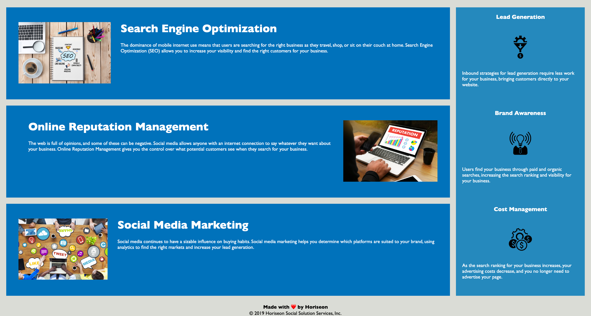

# Code Refactor Project #1

## Description

In this project we were given starter code and were tasked with replacing non-semantic html, adding comments, and removing any repeat code.

## Deployment Link

- [Password Generator](https://t3mpz.github.io/code-refactor/)

## Screen shots

## Usage

In this project I attempted to make a responsive webpage. I incorporated css grid as well as media queries to do so.

## Credits

- [Grid-template-columns](https://developer.mozilla.org/en-US/docs/Web/CSS/grid-template-columns)
- [Grid-auto-rows](https://developer.mozilla.org/en-US/docs/Web/CSS/grid-template-rows)
- [Media-queries](https://developer.mozilla.org/en-US/docs/Web/CSS/Media_Queries/Using_media_queries)
- [View-port-meta](https://developer.mozilla.org/en-US/docs/Web/HTML/Viewport_meta_tag)

## Installation

## License
